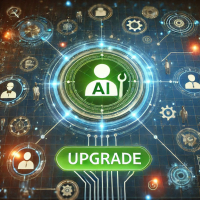

<!-- Copyright (c) 2024 Praneeth Vadlapati -->

#  UpdAgent

AI Agent Version Control Framework for Real-Time Updation of Tools

Created by Praneeth Vadlapati ([@prane-eth](https://github.com/prane-eth))

> [!NOTE]
> Please star :star: the repository to show your support.  

#### Why UpdAgent?
AI agents use tools defined in the code during development and there is currently no automated
method to update the tools despite rapid releases and updates of tools.
This framework defines a way in which we can update the tools into a centralized database.